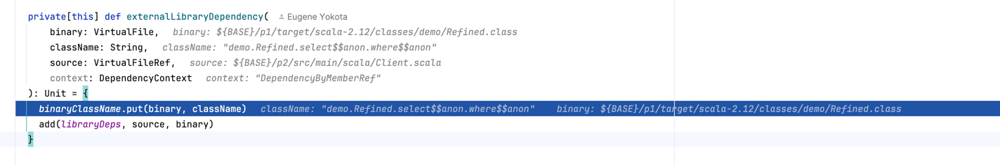

# Zinc Refinement Bug(s)

## Existentiial type param symbol under refinement leads Zinc astray
 
On compilation of `Client.scala`, Zinc traverses into an existential type and
tries to find its enclosing class by looking at the `owner` of the type.
This happens to be a non-local anonymous class. Zinc ends up mis-classifying
this as a third-party library dependency:



- [ ] TODO Figure out what user-facing bug this causes, e.g over- or under-compilation.
   - [ ] Does it also apply to existential types in regular method signatures?   

## Ignore names defined within refinement types

```scala
class C {
  def foo: { def bar: { def baz: Int } } = ???
  // def baz = ??? // Should uncommenting this line invalidate Client?
}
```

```scala
class Client {
  new C().foo.bar.baz
}
```

It seems sufficient for Zinc to include the names/types of the refinment members in the
API hash of `foo`, rather than to create separate entryies for the refinement classes and
members.

## Should `LocateClassFile` call `.initialize`? 
`LocateClassFile.classFile` calls `Symbol#associatedFile`. This will return
`NoAbstractFile` for a `Symbol` that is not initialized. This can occur if the
no expression of type is not used as a the prefix of a selection, or part of
a sub- or same-type test. 

It occurs for `class Box` in `Client.scala`. The
extant behaviour of not declaring a dependency on `Box` may in fact be correct,
Or perhaps we should call `.initialize`? Or treading more lightly, just grab
`.rawInfo match { case cfl: ClassFileLoader => cfl.classFile }`?

Carefully review the changes in https://github.com/sbt/zinc/issues/559 / https://github.com/sbt/zinc/pull/591/files
